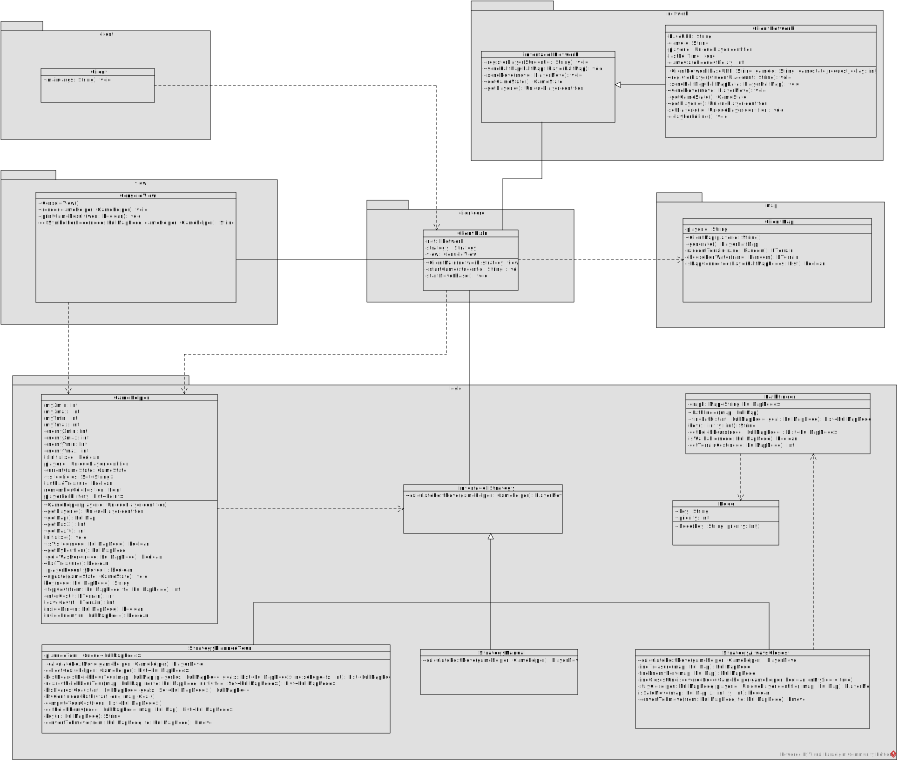
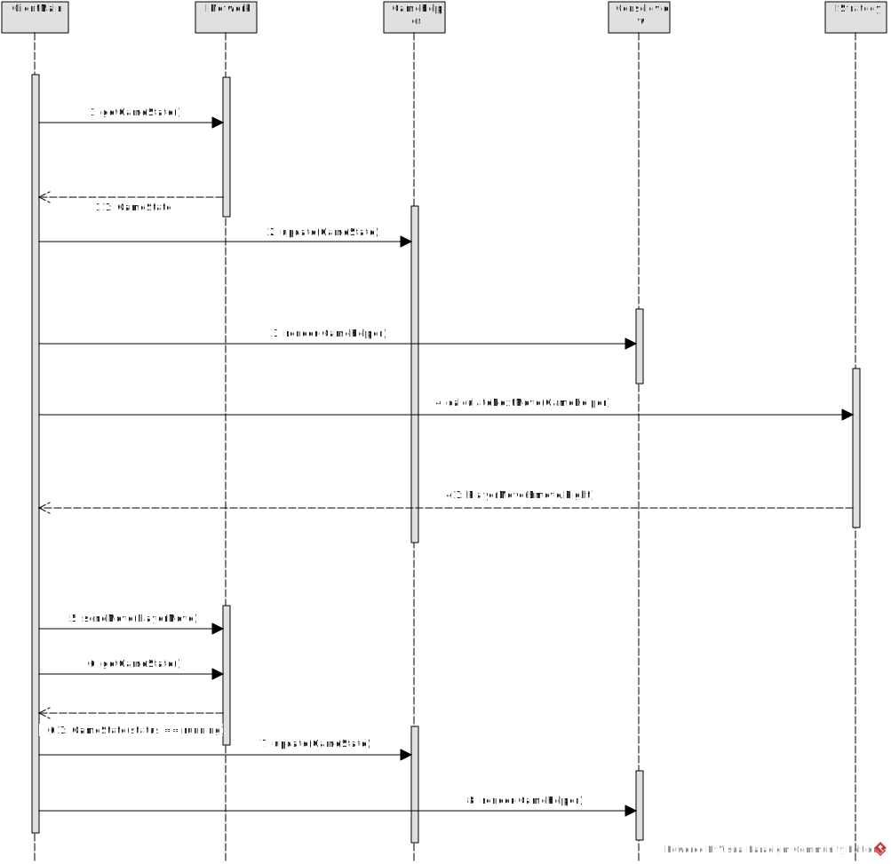
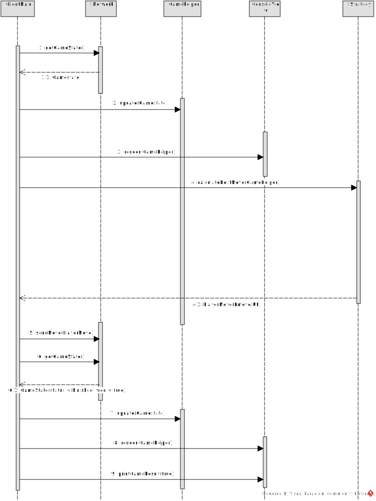

# Software Engineering I - Teilaufgabe 1 (Anforderungsanalyse und Planungsphase)

## Abgabedokument - Teilaufgabe 1 (Anforderungsanalyse und Planungsphase)

### Persönliche Daten, bitte vollständig ausfüllen:

- Nachname, Vorname: Kostariev Dmytro 
- Matrikelnummer: 11848552

## Aufgabe 1: Anforderungsanalyse

### Typ der Anforderung: funktional

**Anforderung 1**

- **Anforderung**: [Spielerregistrierung muss moeglich sein – Ein Client muss sich nach Spielstart beim Server registrieren, um am Spiel teilzunehmen]
- **Bezugsquelle**: [Spielidee: „Nach Start des Clients registrieren sich die KIs fuer das Spiel am Server …“ (ca. Z. 11–13)]

**Anforderung 2**

- **Anforderung**: [Kartenhaelfte muss uebertragen werden - Der Client muss nach erfolgreicher Registrierung eine zufaellig erzeugte Kartenhaelfte an den Server senden.]
- **Bezugsquelle**: [Spielidee: „… erstellen/tauschen danach mit dem Server Kartenhaelften aus.“ (ca. Z. 13–14)
]

**Anforderung 3**

- **Anforderung**: [Spielfigur muss bewegt werden koennen – Die KI muss in der Lage sein, ihre Spielfigur ueber die Spielkarte zu bewegen, um Felder aufzudecken.]
- **Bezugsquelle**: [Spielidee: „Um den Schatz zu finden, bewegen beide KIs ihre Spielfigur ueber die Karte und decken dabei … Kartenfelder auf.“ (ca. Z. 34–37)]

### Typ der Anforderung: nicht funktional

**Anforderung 4**

- **Anforderung**: [Rundenzeit darf nicht ueberschritten werden – Die KI darf nicht laenger als 5 Sekunden fuer eine Spielaktion benoetigen.]
- **Bezugsquelle**: [Spielidee: „Fuer jede dieser rundenbasierten Spielaktionen hat die KI maximal 5 Sekunden Bedenkzeit.“ (ca. Z. 85–86)]

**Anforderung 5**

- **Anforderung**: [Maximale Spielzeit muss eingehalten werden – Ein Spiel muss nach maximal 320 Spielaktionen oder 10 Minuten beendet werden.]
- **Bezugsquelle**: [Spielidee: „… dass ein Spiel insgesamt nicht laenger als 320 Spielaktionen (und damit 320 Runden) dauern darf … Insgesamt dauert ein Spiel maximal 10 Minuten.“ (ca Z. 80–88)]

**Anforderung 6**

- **Anforderung**: [Client muss serverkompatibel sein – Der Client muss ausschliesslich die vom Protokoll definierten Nachrichtenstrukturen verwenden, um Kompatibilitaet sicherzustellen]
- **Bezugsquelle**: [Netzwerkprotokoll: „… standardisiertes Netzwerkprotokoll … ermoeglicht Ihnen … gegen andere Studierende anzutreten.“ (ca. Z. 10–15)]

### Typ der Anforderung: Designbedingung

**Anforderung 7**

- **Anforderung**: [Die Implementierung muss in Java erfolgen – Die KI-Implementierung muss vollstaendig in der vom Institut vorgegebenen Programmiersprache Java erfolgen. Andere Programmiersprachen oder Frameworks duerfen nicht verwendet werden.]
- **Bezugsquelle**: [Technische Uebungsvorgaben / Netzwerkbibliothek: https://homepage.univie.ac.at/kristof.boehmer/SE1/Network_Library/Documentation/]

## Aufgabe 2: Anforderungsdokumentation

### Anforderungsüberblick

- **Name**: [Spielfigur bewegen]
- **Beschreibung und Priorität**: [Der Client muss Bewegungskommandos fuer die eigene Spielfigur absetzen koennen, um sich orthogonal feldweise ueber die Karte zu bewegen und dabei Felder aufzudecken. Die Anforderung ist Hoch, da ohne Bewegung weder Schatz noch gegnerische Burg gefunden werden koennen.]
- **Relevante Anforderungen**:
   - A1 Registrierung muss moeglich sein (Zugriff auf Spiel ueberhaupt).
   - A2 Kartenhaelfte muss uebertragen werden (Karte entsteht aus beiden Haelften).
   - A4 Rundenzeit darf nicht ueberschritten werden (<= 5 s/Aktion).
   - A5 Maximale Spielzeit muss eingehalten werden (<= 320 Aktionen/10 min).
   - A6 Client muss serverkompatibel sein (Nachrichtenformat/Protokoll).

- **Relevante Business Rules**: 

   - Rundenbasiert: Pro Runde genau eine Aktion; Aktion nur, wenn „ an der Reihe “.
   - Zeitlimits: <= 5 s Bedenkzeit je Aktion; Spiel <= 320 Aktionen/<= 10 min.
   - Bewegungsrestriktionen: nur horizontal/vertikal zu benachbarten Feldern; Wasser darf nicht betreten werden (sofortige Niederlage); Kartenflucht (Off-Map) fuehrt ebenfalls zum Verlust.
   - Terrainkosten & Effekte: Wiese 1 Aktion (aufdecken/ggf. Schatz aufnehmen); Berg 2 Aktionen hinein + 2 hinaus; beim Betreten Berg werden versteckte Schaetze/Burgen in Reichweite 1 (auch diagonal) aufgedeckt.
   - Sichtbarkeit: Zu Beginn sind Terrain, eigene Burg, Spielerpositionen sichtbar; Schatz & gegnerische Burg werden erst beim Aufdecken sichtbar. Gegnerposition ist in den ersten 8 eigenen Aktionen zufaellig.
   - Statuspruefung: Client muss vor Aktionsversand pruefen, ob er an der Reihe ist (Status-/Turn-Nachricht). 

### Impuls/Ergebnis - Typisches Szenario

**Vorbedingungen:**

- Client ist registriert und Teil eines laufenden Spiels (SpielID bekannt).
- Karte wurde erzeugt (Kartenhaelften uebertragen/zusammengefuegt).
- Client ist laut Status an der Reihe.

**Hauptsaechlicher Ablauf:**

1. Impuls: Client fragt Spielstatus ab (Zugrecht).
   Ergebnis: Server bestaetigt „an der Reihe“.

2. Impuls: Client sendet Bewegung „rechts“ (orthogonal, 1 Feld).
   Ergebnis: Server validiert Zug (Zeitlimit, Feld erreichbar, kein Wasser/Off-Map). Bei Erfolg wird Position intern aktualisiert.

3. Impuls: Server wertet neue Position aus.
   Ergebnis: Feld wird aufgedeckt; bei Wiese: evtl. Schatz/Burg sichtbar/aufgenommen; bei Berg: zusaetzliche Aufdeckung in Reichweite 1.

4. Impuls: Server sendet aktualisierte Sicht-/Positionsdaten (z. B. via ResponseEnvelope).
   Ergebnis: Client aktualisiert Karte im CLI. Runde endet, Gegenspieler ist am Zug.

**Nachbedingungen:**

- Client hat die neue Spielerposition, aufgedeckte Felder und ggf. Inventarstatus (Schatz aufgenommen) lokal aktualisiert.

### Impuls/Ergebnis - Alternativszenario

**Vorbedingungen:**

- Client ist registriert und Teil eines laufenden Spiels (SpielID bekannt).
- Karte wurde erzeugt (Kartenhaelften uebertragen/zusammengefuegt).
- Client ist laut Status an der Reihe.
- Es wurden bereits mehrere Bewegungsbefehle in eine Richtung gesendet (z. B. nach links), die Ausfuehrung ist aber noch nicht - vollstaendig abgeschlossen.
- Es sind < 8 eigene Aktionen absolviert (Gegnerposition kann noch zufaellig wirken).

**Hauptsaechlicher Ablauf:**

1. Impuls: Client fragt Spielstatus ab (Zugrecht).
   Ergebnis: Server bestätigt „an der Reihe“.

2. Impuls: Client ändert die Bewegungsrichtung (z. B. statt „links“ jetzt „oben“) und sendet den neuen Bewegungsbefehl.
   Ergebnis: Alle zuvor gesendeten, aber noch nicht vollständig ausgeführten Bewegungsbefehle verfallen; die dafür aufgewendeten Spielrunden zählen trotzdem als verbraucht. Die neue Richtung wird ab jetzt gezählt/bewertet.

3. Impuls: Server validiert die neue Bewegung (Zeitlimit, Feld erreichbar, kein Wasser/Off-Map).
   Ergebnis: Bei Erfolg wird die Position entsprechend aktualisiert; das Zielfeld wird aufgedeckt (bei Wiese: ggf. Schatz/Burg sichtbar/aufgenommen; bei Berg: zusätzlicher Aufdeck-Effekt in Reichweite 1).

4. Impuls: Server sendet Sicht-/Positionsupdate.
   Ergebnis: Client aktualisiert die Karte im CLI. Gegnerposition kann in den ersten 8 eigenen Aktionen zufällig „springen“ und wird dennoch angezeigt. Runde endet, Gegenspieler ist am Zug.

**Nachbedingungen:**

- Rundenanzahl hat sich auch durch die verfallenen Bewegungen erhoeht; der Client hat dadurch Aktionsbudget verloren, ohne die urspruenglich geplante Wegstrecke vollstaendig zurueckgelegt zu haben.

- Karte/Sicht wurden gemaess neuem Zug aktualisiert; ggf. Inventar (Schatz aufgenommen) angepasst.

- Im CLI ist die (ggf. zufaellige) Gegnerposition konsistent dargestellt (fruehe Spielphase).

### Impuls/Ergebnis - Fehlerfall

**Vorbedingungen:**

- Client ist registriert (SpielID bekannt) und mit dem Server verbunden.
- Eine Karte liegt vor (Kartenhaelften wurden uebertragen/zusammengefuegt).
- Der Client verfuegt ueber eine gueltige, letzte Statusantwort (Turn-Info).

- Fehlerfall A: Bewegung wuerde Wasser betreten (oder Off-Map verlassen)

**Hauptsaechlicher Ablauf:**

   1.   Impuls: Client sendet eine Bewegung, deren Zielfeld Wasser oder ausserhalb der Karte ist.
        Ergebnis: Server erkennt Regelverstoss. Betritt die Spielfigur Wasser bzw. verlaesst die Karte, verliert die KI sofort.
   
   2.   Impuls: Server sendet Abschlussmeldung (Sieg/Niederlage) im Response; der Gegenspieler wird ueber seinen Sieg informiert.
        Ergebnis: Client zeigt im CLI den Endzustand und terminiert sich gemaess Vorgabe; es werden keine weiteren Aktionen (Kartenhaelfte, Bewegungen) mehr gesendet.

**Nachbedingungen:**

- Spiel beendet; Verlierer: die regelverletzende KI. Client beendet sich selbststaendig.

- Fehlerfall B: Client sendet Aktion, obwohl er nicht an der Reihe ist

**Hauptsaechlicher Ablauf:**

  1. Impuls: Client ueberspringt die Statuspruefung oder ignoriert sie und sendet eine Bewegung, obwohl der Gegner an der Reihe ist.
     Ergebnis: Server stellt Regelverstoss fest; Clients, die diese und andere Spielregeln nicht einhalten, werden bestraft (Verlust).
  
  2. Impuls: Server sendet Abschlussmeldung (Niederlage) im Response.
     Ergebnis: Client zeigt im CLI den Endzustand und terminiert sich.

**Nachbedingungen:**
- Spiel beendet; Verlierer: der Client, der ohne Zugrecht agiert hat.

- Fehlerfall C: Zeitlimit pro Aktion (5s) wird ueberschritten

**Hauptsaechlicher Ablauf:**
  1. Impuls: Client benoetigt fuer die naechste Bewegungsentscheidung/-sendung laenger als 5 Sekunden.
     Ergebnis: Die aktive KI verliert automatisch (Zeitlimitverletzung).
  
  2. Impuls: Server sendet Abschlussmeldung (Niederlage) an den Client; der andere Spieler wird ueber den Sieg informiert.
     Ergebnis: Client zeigt im CLI den Endzustand und terminiert sich.

**Nachbedingungen:** 
 - Spiel beendet; Verlierer: aktive KI wegen Zeitueberschreitung. Keine weiteren Aktionen werden gesendet.
 
### Benutzergeschichten

- Als Client-KI moechte ich meine Spielfigur orthogonal ueber die Karte bewegen, um Felder aufzudecken 🧭 und den Schatz zu finden 💰.

- Als Server moechte ich jede Bewegungsaktion der KI validieren ✅ (Zugrecht, Zeitlimit, Terrainregeln), um Spielregeln korrekt durchzusetzen ⚖️ und die Sichtinformationen aktuell zu halten.

- Als menschlicher Anwender 👤 moechte ich ueber die CLI den aktuellen Kartenstatus, die Position der Spielfigur und aufgedeckte Felder erkennen

### Benutzerschnittstelle

|   | 0 | 1 | 2 | 3 | 4 | 5 | 6 | 7 | 8 | 9 |
|---|---|---|---|---|---|---|---|---|---|---|
| 0 | 🏰 | 🟩 | 🟩 | 🟩 | 🟦 | 🟩 | 🟩 | 🟩 | 🟦 | 🟩 |
| 1 | 🟩 | 🟩 | 🟫 | 🟩 | 🟩 | 🟩 | 🟫 | 🟩 | 🟩 | 🟦 |
| 2 | 🟩 | 🟩 | 🧍 | 🟩 | 🟩 | 🟩 | 🟩 | 🟩 | 💰 | 🟩 |
| 3 | 🟩 | 🟫 | 🟩 | 🟩 | 🟦 | 🟩 | 🟦 | 🟩 | 🟩 | 🟩 |
| 4 | 🟩 | 🟩 | 🟩 | 🟫 | 🟦 | 🟦 | 🟩 | 🏯 | 🧑‍🎤 | 🟫 |

Legende:

🏰 = eigener Burg

🟦 = Wasser (verboten)

🟩 = Wiese

🟫 = Berg

💰 = Schatz (falls aufgedeckt)

🧍 = eigene Spielfigur

🏯 = gegnerischer Burg

🧑‍🎤 = gegnerische Spielfigur

### Externe Schnittstellen

- Netzwerkkommunikation erfolgt ueber eine REST-aehnliche Schnittstelle (HTTP, XML) gemaess dem bereitgestellten Netzwerkprotokoll.
  - Anfrage (Client): Bewegung an Server senden (POST) → Endpunkt 
    /games/{GameID}/players/{PlayerID}/move
   → Inhalt: Bewegungsrichtung (UP, DOWN, LEFT, RIGHT), Metadaten (PlayerID, GameID)
  - Antwort (Server): ResponseEnvelope (XML) mit aktualisierten Sichtdaten (z. B. Position, neue Felder, Spielstatus).

- Protokolleigenschaften:
  - Transport: HTTP
  - Datenformat: XML
  - Statuscode: immer 200 (vereinfachtes Handling)
  - Server validiert Bewegung (Zugrecht, Terrain, Zeitlimit) → Client aktualisiert CLI.

- Abhaengigkeiten / Einschraenkungen:
  - Nur orthogonale Bewegungen erlaubt.
  - Wasser- oder Off-Map-Bewegungen fuehren zur sofortigen Niederlage.
  - Aktionen nur waehrend des eigenen Zugs zulaessig.

 ### Quellen dokumentieren - Aufgabe 2: Anforderungsdokumentation

- Bewegung & Aufdecken der Felder (Ziel: Schatz → gegnerische Burg)
- Bezugsquelle: Spielidee (ca. Z. 34–45).

- Rundenbasiert, genau 1 Aktion pro Zug; Zugrecht pruefen
- Bezugsquelle: Spielidee (ca. Z. 90–110).

- Zeitregeln: ≤ 5 s pro Aktion; Spiel ≤ 320 Aktionen bzw. ≤ 10 Min
- Bezugsquelle: Spielidee (ca. Z. 120–140).

- Kartenaufbau: 2 × (5×10) → Server fuegt zu 10×10 oder 5×20; Terrain: Wasser/Wiese/Berg
- Bezugsquelle: Spielidee (ca. Z. 150–185).

- Regeln: nur orthogonal; Wasser/Off-Map ⇒ sofortige Niederlage; Burg/Schatz nur Wiese
- Bezugsquelle: Spielidee (ca. Z. 185–215).

- Sichtbarkeit: Terrain/Burg/Startpos sichtbar; Schatz & gegnerische Burg versteckt; Gegnerpos in ersten 8 eigenen Aktionen zufaellig
- Bezugsquelle: Spielidee (ca. Z. 55–85 + Hinweis „Zufaellige Position des Gegners…“).

- Registrierung der Clients mit Spiel-ID (Start durch Menschen; danach vollautomatisch)
- Bezugsquelle: Spielidee (ca. Z. 10–25).

- Netzwerkprotokoll: HTTP + XML; „REST-aehnlich“; Server antwortet (vereinfachend) i. d. R. mit 200
- Bezugsquelle: Netzwerkprotokoll / Einleitung + Allgemeines (Dok-Beginn, Abschn. 1 & 4).

- Use-Cases/Methodenmodellierung: Registrieren, Kartenhaelfte senden, Status pruefen, Bewegungen; ResponseEnvelope als Antwort-Wrapper
- Bezugsquelle: Netzwerkprotokoll / Modellierung + Use-Case-Leitfaden (Abschn. 2–3).

- Spielerzeugung (Game-ID), Registrierung (POST /games/{id}/players), Statusabfrage vor Aktionen
- Bezugsquelle: Netzwerkprotokoll / Absch. 5–6 + Status-Hinweise (Endpoints & Nachrichten).

## Aufgabe 3: Architektur entwerfen, modellieren und validieren

### Klassendiagramm

Das Klassendiagramm zeigt die Architektur des Clients in drei Schichten:

1. Netzwerk (INetwork, ClientNetwork):
  - ClientNetwork implementiert INetwork und kapselt die REST-aehnliche HTTP/XML-Kommunikation (Registrierung, Kartenhaelfte, Bewegung, Status). Diese Schicht bietet eine einheitliche Schnittstelle fuer die uebrige Anwendung.

2. Spiellogik / KI (IStrategy, StrategyManual, StrategyNearestNeighbour, StrategyAlwaysClosest, Pathfinder, GameHelper, Node):

  - IStrategy definiert das Strategien-Interface; konkrete Strategien waehlen die naechste Aktion.

  - Pathfinder berechnet Wege (auf Basis von Node-Strukturen).

  - GameHelper buendelt Spielkontext und Regellogik (z. B. Zeit-/Rundeninformationen, Terrain-/Grenzpruefungen, Heuristiken), die Strategien und Steuerung wiederverwenden.

3. Darstellung / Zustand (ClientMap, ConsoleView):
  
  - ClientMap haelt den Spielzustand (Karte, Sicht, Positionen).

  - ConsoleView rendert die Karte in der CLI und beruecksichtigt die Sichtbarkeitsregeln (Schatz/gegnerische Burg erst nach Aufdeckung).

Steuerung: ClientMain koordiniert den Ablauf: Er haelt Referenzen auf INetwork, IStrategy und ClientMap, fragt ueber INetwork den Server, berechnet ueber die Strategie die naechste Bewegung und triggert die Aktualisierung der ConsoleView.

### Sequenzdiagramm 1

- Beschreibung – Sequenzdiagramm Szenario 3
  (Client hat den Schatz noch nicht gefunden)

- Dieses Sequenzdiagramm beschreibt den Ablauf einer regulaeren Bewegungsaktion waehrend der Spielphase, in der der Client den Schatz noch nicht gefunden hat:

1. ClientMain fragt ueber INetwork den aktuellen Spielstatus mit getGameState() ab.
   - Der Server liefert den Status zurueck (GameState).

2. ClientMain aktualisiert daraufhin den lokalen Spielzustand ueber GameHelper.update(GameState).

3. ClientMain ruft ConsoleView.render(GameHelper) auf, um den aktuellen Spielzustand in der CLI darzustellen.

4. ClientMain initiiert ueber IStrategy die Berechnung der naechsten Bewegung (calculateNextMove(GameHelper)).
   
   - Die Strategie waehlt eine Richtung basierend auf dem aktuellen Karten- und Sichtzustand — hier z. B. Emove.RIGHT.

5. ClientMain sendet die berechnete Bewegung (PlayerMove) ueber INetwork.sendMove(PlayerMove) an den Server.

6. Anschließend wird der Spielstatus erneut ueber getGameState() abgefragt und vom Server zurueckgegeben.

7. ClientMain aktualisiert den Spielzustand erneut (GameHelper.update(GameState)).

8. Abschließend rendert ConsoleView die neue Spielsituation nach der Bewegung in der CLI.

- Zusammenfassung:

Dieses Szenario zeigt einen Standardzug, bei dem die KI noch auf Schatzsuche ist. Der Spielstatus wird abgefragt, Strategie berechnet die Bewegung, der Zug wird uebertragen und die Darstellung aktualisiert.

### Sequenzdiagramm 2

 - Beschreibung – Sequenzdiagramm Szenario 5

 - (Client hat Schatz bereits gefunden, steht unter gegnerischer Burg auf Bergfeld)

 - Dieses Sequenzdiagramm zeigt den Ablauf, wenn der Client bereits den Schatz gefunden hat und unterhalb der gegnerischen Burg auf einem Bergfeld steht. 
 
 - Ziel: Sieg durch Erreichen der gegnerischen Burg.

 1. ClientMain fragt ueber INetwork den aktuellen Spielstatus mit getGameState() ab.
    
    - Der Server liefert den Status zurueck (GameState).

 2. ClientMain aktualisiert den lokalen Zustand ueber GameHelper.update(GameState).

 3. ConsoleView.render(GameHelper) gibt die aktuelle Spielsituation aus.

 4. ClientMain ruft die Strategie ueber IStrategy.calculateNextMove(GameHelper) auf.
    
    - Die Strategie erkennt die nahegelegene gegnerische Burg und waehlt Emove.UP, um das Ziel zu erreichen.

 5. ClientMain sendet den berechneten Spielzug ueber INetwork.sendMove(PlayerMove) an den Server.

 6. Der Spielstatus wird erneut abgefragt (getGameState()), der Server liefert eine Antwort mit GameState(status = Finished, won = true).

 7. Der lokale Zustand wird nochmals aktualisiert (GameHelper.update(GameState)).

 8. ConsoleView.render(GameHelper) zeigt den Endzustand (Burg betreten, Spielende) an.

 9. ClientMain ruft printGameResult(true) auf und beendet den Client gemaess Spielvorgaben.

➡ Zusammenfassung:

Dieses Szenario stellt den Siegzug dar: Der Schatz ist bereits im Besitz des Clients. Die Bewegung fuehrt direkt zur gegnerischen Burg. Nach Ausfuehrung des Zugs meldet der Server Spielende (Status Finished), der Client aktualisiert und zeigt das Endergebnis an.

### Quellen dokumentieren - Aufgabe 3: Architektur entwerfen, modellieren und validieren

- **Kurzbeschreibung der uebernommenen Teile**
  
  - Architekturgrundlagen (Dreischichtmodell: Netzwerk / Logik / Darstellung)
  
  - Formulierungen zu Schichten, Klassenbeziehungen und Verantwortlichkeiten.

  - Konzept zur Aufteilung in Makro- und Mikroarchitektur.

  - Begriffe und Strukturierung nach SE1-Vorlesung (Analyse–Entwurf–Implementierung).

  - Anpassung und Konkretisierung auf eigenes Projekt (Client für das Schatzspiel).

- **Quellen der uebernommenen Teile**
  
  - Lehrunterlagen der LV Software Engineering I
  
    - [Software Engineering I | Anforderungsanalyse_Unterlagen.pdf]

    - [Software Engineering I | Entwurf_Unterlagen.pdf]

  - Netzwerkprotokoll-Dokumentation (bereitgestellt über Moodle / LV-Webseite)

  - Eigene Anpassung und Erweiterung der Inhalte auf das eigene Projekt

## Aufgabe 4: Quellen dokumentieren

# Anforderungsanalyse

**Kurzbeschreibung der übernommenen Teile**

 - Begrifflichkeit und Struktur (funktional/nicht-funktional/Designbedingung), Validierungskriterien und Formulierungsschema fuer Anforderungen.

 - Einzelne Regelinhalte (Zeitlimit 5 s, max. 320 Zuege/10 min, Sichtbarkeit, Terrainregeln) aus der Spielidee/Protokollbeschreibung.

**Quellen der übernommenen Teile**

 - Dokument Spielidee (bereitgestellt zur Aufgabe).

 - Netzwerkprotokoll-Beschreibung (HTTP/XML, Endpunkte, Statuslogik).

 - Vorlesungsfolien Software Engineering I | Anforderungsanalyse_Unterlagen.pdf (Begriffe & Qualitaet von Requirements).

 - Eigene Ausarbeitung und Strukturierung der Anforderungen auf Basis dieser Quellen.

# Anforderungsdokumentation

**Kurzbeschreibung der uebernommenen Teile**

- Aufbau der Doku (Name, Priorität, Business Rules, Impuls/Ergebnis-Listen, Benutzerstories, UI-Mockup, externe Schnittstellen).

- Wortlaute einzelner Regeln (orthogonale Bewegung, Wasser/Off-Map ⇒ Niederlage, Berg-Kosten).

**Quellen der uebernommenen Teile**

- Spielidee/Protokoll (Regeln, Sichtbarkeit, Rundenlogik).

- Vorlesungsfolien SE I | Anforderungsanalyse_Unterlagen.pdf (User-Stories, Szenarien).

- Eigene Ausarbeitung der Szenarien, UI-Mockup, Beispiele und Texte.

# Architektur entwerfen, modellieren und validieren

**Kurzbeschreibung der übernommenen Teile**

- Dreischichtmodell (Netzwerk / Logik / Darstellung) als Strukturprinzip.

- Vorgehen Makro- vs. Mikroarchitektur; Einsatz Sequenzdiagramme zur Validierung.

- Benennung generischer Rollen/Methoden (getGameState, sendMove) gemass Protokollidee.

**Quellen der uebernommenen Teile**

- Vorlesungsfolien SE I | Entwurf_Unterlagen.pdf(Schichten, Entwurfsprinzipien, Sequenzdiagramme zur Validierung).

- Netzwerkprotokoll-Beschreibung (Kommunikationsmuster Request/Response, XML-Payload).

- Tool: Visual Paradigm Community Edition (Erstellung der UML-Diagramme).

- Eigene Modellierung der Klassen/Beziehungen/Methoden; eigene Sequenzen für Szenario 3 & 5.

